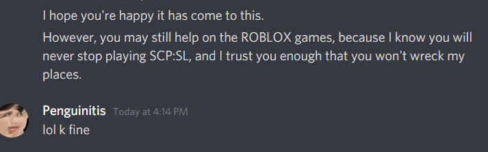
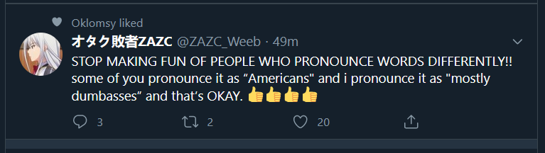
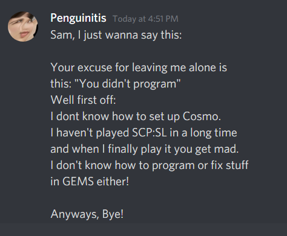
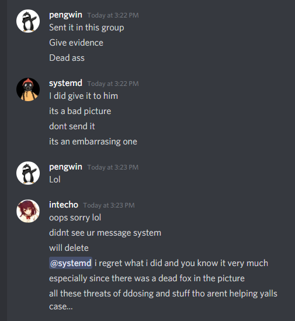
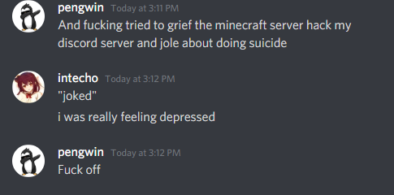
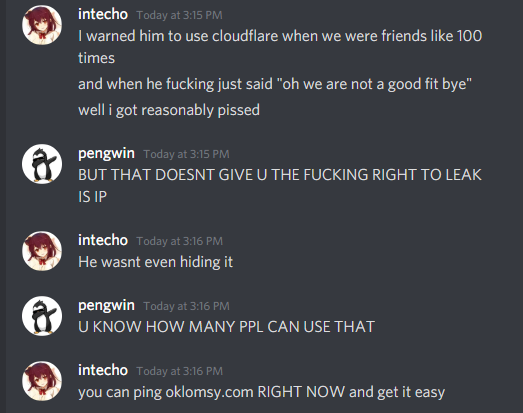
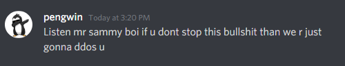

# Oklomsy Truth (formerly Oklomsy Definition)
## Made public as a PSA for anyone who doesn't know Oklomsy, but wants to add him.

### The original.
A fat turd who sits on his rump all day playing SCP:SL or TF2, and makes a lazy time of "helping" on projects. By that I mean he only changes minor documentation if anything. He loves sitting on his rump playing SCP games and TF2, especially SCP:SL, but he also love eating rice and noodles, and candy, but not Hershey's. All while sitting on his rump. He is the worst freaking excuse for a human I have ever met besides me, and even I talk to my friends when I get a chance. The only redeeming quality about him: he's very nice but quite toxic if you make him mad. Sometimes he gets mad, but hey, we all do. What I cannot excuse, however, is taking your "BFF" and not talking to him for DAYS in a row, instead playing SCP:SL or some other SCP game. I can understand having SOME time alone or SOME time with family, but ALMOST NEVER TALKING TO YOUR "BFF"? That's just rude! And you know what? I am done with it. I was going to give him a new start by letting him contribute to GEMS NT, but after showing him 2 demos over 2-3 days,  I haven't gotten a response. He's just been either offline or playing SCP games on do not disturb. And that's why I am done with him. Because he is a jerk who takes SCP games over talking to his friends.

Update: just noticed that I told him what it has come down to, and he was like "lol k fine", like WTF oklomsy?
  

Update 2: I just noticed a few minutes before he replied the above he liked a tweet that said something along the lines of: I mispronounce "americans" as "mostly dumbasses" and that's ok! Well I "mispronounce Oklomsy" as "a fuckaroo."

  

Update 3: He said this.
  
My response: YOU ALWAYS PLAY SCP:SL, LIAR. (Update Dec. 26 2020: he plays tf2 mostly now like 60% of the time and 10% of the time is Roblox.) Second off: Cosmos is easy to set up, you *obviousally* didn't even try! And third off: GEMS NT is much easier to program for than GEMS, so you could have at least TRIED. So you sack of shit, stop trying to defend yourself.

He also said he was at the beach or was chilling for 4+ days and that's why he hasn't played SCP:SL. First off, I understand not calling me during your vacation, but *chilling?* Stop. Just stop. Second off: If you wanted to play SCP:SL, it's your fault for chilling in the first place dude instead of playing.

Update 4: he unblocked me, but I posted memes and he blocked me again. What a moron. I have updated the statements accordingly

I have since blocked him from even contributing since he's so useless.

### Almost there...

Update 5: (4/13/21) I decided to give him a couple more chances. One he blocked me for sending a meme, and the final one he said "oh I will only be gone awhile, I just want to play with *friend name redacted*" but 2-4 days later he said "oh tell him he may or may not be blocked forever." to another former friend. So you know what? I'm just gonna move on with my life, and block Oklomsy. 

Public note: his username ends with id #7895. Do not talk to this jerk since he won't talk to you, or if you post memes to him when he does talk to you, if it's the wrong kind of meme he *will* block you.

### The FALSE verdict
Update 6 (4/21/21): He claims he's the problem now. I don't blame him, I personally agree. Basically he said "It's rather you need to find better friends than me, cause I treat you really badly which isn't healthy for our friendship." Cannot agree more, but it's such a shame our friendship had to end on such a bad note. Please friend him if you are expecting a nice quiet friend with ocasional... well he wouldn't want me to tell you exactly but let's just say "week long breaks." He also occasionally gets angry.

### Serious this is final. The Impossible Case. (5/25/21)
He is a shitty excuse for a friend, I know he's gonna post about his claims I "DOXED" him. Really, this is what happened:
* Try to play a small prank on him.
  * This would basically involve my friend showing him his face, him being like "how did you get my face", and me being like "just a prank bro."
* Give a fellow prankster the necessary face and he refused.
  * Let's keep in mind he leaked a picture of his brother to me so I could draw it.
  * He also regrets it as much as I regret these pranks.
* Share the IP any idiot could have gotten to 2 of my best friends. Could have been gotten by:
  * By pinging.
  * By using an online skiddie "Get IP from URL" tool
  * And NO, he doesnt use Cloudflare or ANY IP/DDOS protection
  * Warned him several times, he refused. In fact he lies about Cloudflare being "insecure" and "blocking TOR users" when people could easily block that.
  * He might call them "shady ddosers" but they are anything but.
* Tried to make peace and friendship several times before resorting to pranking him like this.
  * I was even willing to change myself to conform to his standards.
  * He of course declined peace and friendship. So of course I was upset.
  * Being a fellow nerd, of course I played this SMALL PRANK on Oklomsy to make myself feel better.
* IPs can only get the City and Provence/State your in AT MOST. Whats wrong with giving that to 2 trustworthy people for a small joke?
  * Especially since you could get it easily...
* NSA already knows his face, so what's wrong with me sharing it with 1 friend that's trustworthy to play a prank? Especially since he REFUSED.

 And now, his friend and my former friend thinks I am the bad one and he's threatening to DDOS me. I now regret these pranks even if I shouldn't. As for "griefing pengwins server" and "hacking his discord server" this was a few year ago and I was a more aggressive person back then. As for "joking about suicide" I wasn't joking, I was genuinely depressed. Fuck oklomsy and fuck pengwin..
  
  
  
  

# Another important update
Turns out apologizing was a big mistake. Baiscally I realized the previous actions were reckless the day after I posted this, said sorry and explained my actions and words in more detail, and he told me to take this down and leave him alone. Naturally, being a good friend I agreed. What I didn't know is that this would allow him to DM my friends saying that I am the bad one, even though I have left him alone for all this time and removed this posting like he said. Not even hinting that I had said sorry, or going in detail to what HE had done, and how relatively calm I have been until going all sicko mode with the previous actions. Unfortunatly I can't give proof for fear that my friend who told me this would get yelled at by Oklomsy. But nevertheless, I reckognize the previous actions were wreckless, but I already said sorry. He ignored that appology, what he did beforehand, how I calm I was before me doing the above, and exaggerated the facts, purpousfully leaving out some facts that would make this case into MY favor, to suit his needs. He is the WORST "friend" who WILL take advantage of you, and then cry about you bullying him when you screw up; even when you say sorry. Fuck oklomsy, he knows what he has done. I'm out. Peace.
